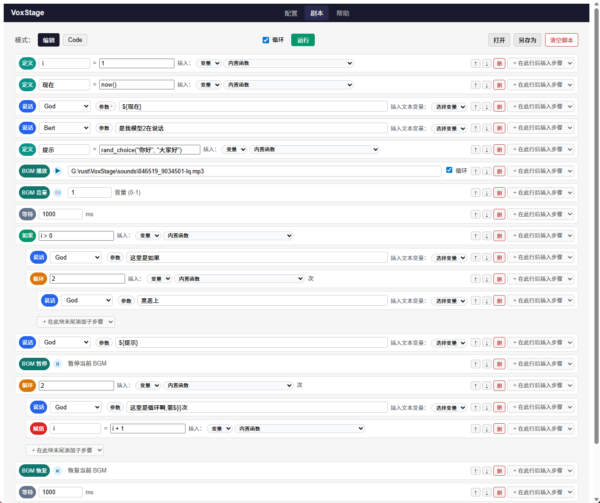
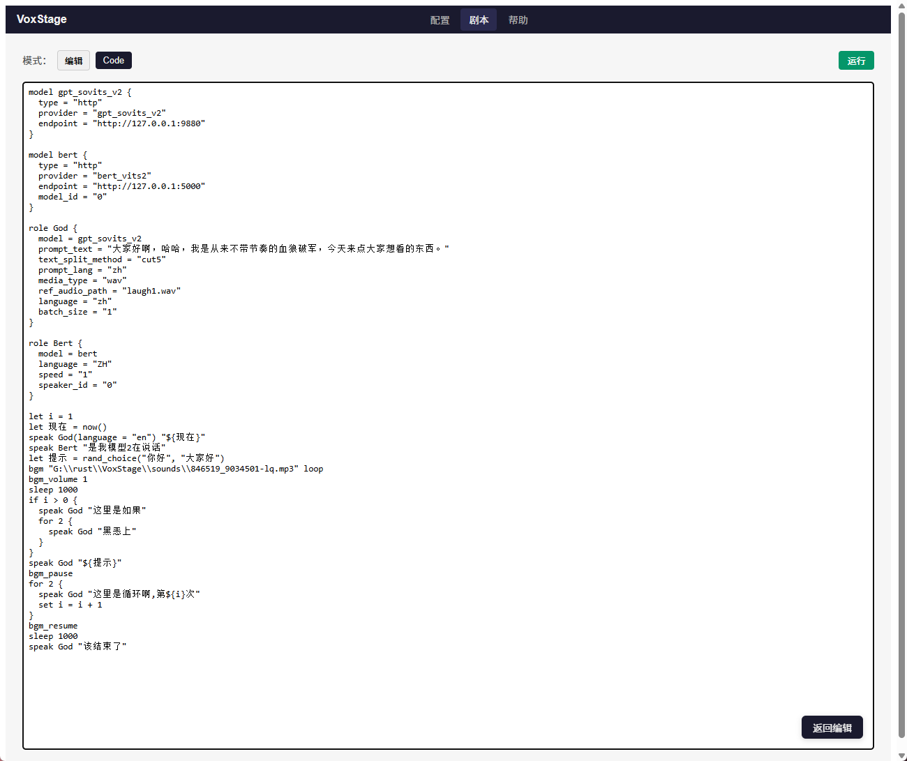

## VoxStage 项目说明

VoxStage 是一个基于 Rust 的 DSL 驱动 AI 语音执行引擎，目标是通过自定义脚本语言调度多种 TTS 模型（远程 / 本地），实现 AI 主播、有声小说、多角色对白等场景下的高频模型切换与音频播放。

当前仓库处于 **核心骨架搭建阶段**，重点在于模型调用层与音频播放层的解耦设计。

---

## 项目架构概览

项目采用 **Cargo workspace + 多 crate 分层**，按职责拆分为：

- **`vox-core`（crates/core）**  
  - 定义跨层共享的领域模型与抽象：
    - `TtsProvider`：统一的 TTS Provider trait。
    - `ModelCapabilities`：模型能力声明（speed / volume / pitch / emotion / streaming / custom）。
    - `SynthesisRequest`：合成请求统一结构。
    - `AudioStream`：音频流抽象（当前为 `Full(Vec<u8>)`）。
    - `TtsError`：TTS 错误类型。
  - 不依赖任何具体 HTTP 客户端或音频库，是整个系统的基础层。

- **`vox-tts-http`（crates/tts-http）**  
  - 封装通过 HTTP 调用外部 TTS 服务的 Provider 实现：
    - `BertVits2Provider`（Bert-VITS2，GET `http://localhost:5000/voice`）。
    - `GptSovitsV2Provider`（GPT-SoVITS v2，GET `http://127.0.0.1:9880/tts`），支持：
      - `text` / `text_lang` / `prompt_text` / `prompt_lang`；
      - `ref_audio_path` / `batch_size` / `media_type` / `streaming_mode` 等参数（由 DSL 中的字段透传）。
  - 使用 `reqwest` 负责 HTTP 通信，将 `SynthesisRequest` 映射为 HTTP 请求，并返回 `AudioStream`。
  - 对上暴露 `TtsProvider` 接口，对下屏蔽具体 HTTP 细节。

- **`vox-dsl`（crates/dsl）**  
  - 脚本语言解析层：将 `.vox` 源码解析为 AST（`Script` / `Item` / `Expr` 等）。
  - 支持 `model` / `role` / `let` / `set` / `speak` / `sleep` / `if` / `for` / `while` 以及 **BGM 语句**（`bgm` / `bgm_volume` / `bgm_pause` / `bgm_resume` / `bgm_stop`），其中：
    - `let` / `set` / `if` / `for` / `while` 的右侧条件与次数均为统一的表达式（支持字面量、变量、算术、比较、逻辑、函数调用与括号）。

- **`vox-audio`（crates/audio）**  
  - 基于 `rodio` 的音频播放模块：
    - `play_audio_blocking(data: &[u8])`：使用系统默认输出设备播放一段完整音频数据（TTS），播放结束前阻塞。
    - `BgmController`：独立 BGM 轨道，支持：
      - `play_bgm(data, loop)`：播放/切换背景音，可选循环；
      - `pause_bgm()` / `resume_bgm()` / `stop_bgm()`；
      - `set_bgm_volume(volume)`。
    - `AudioError`：播放相关错误。
  - 未来会在此基础上扩展 `AudioQueue`、设备枚举与选择等能力。

- **`vox-engine`（crates/engine）**  
  - 执行引擎层，负责：
    - `ModelManager`：`HashMap<String, Arc<dyn TtsProvider>>` 管理所有已注册模型，支持 O(1) 切换。
    - 从 DSL AST 中收集 `role` / `let` 定义。
    - 解释执行控制流语句：`let` / `set` / `speak` / `sleep` / `if` / `for` / `while` 以及 **BGM 语句**。
    - 内置表达式求值器：将 `Expr` 解析为运行时值（`Int` / `Bool` / `Str`），支撑 `let/set/if/for/while` 的运算与内置函数（`now` / `time_hour` / `time_minute` / `time_second` / `rand` / `rand_int` / `rand_bool` / `rand_choice`）。
    - 支持根据脚本中的 `model` 块自动注册 Provider：`register_providers_from_script` 读取 `ModelDef`，由调用方工厂将 `type` / `provider` / `endpoint` / `model_id` 等字段映射到具体 `TtsProvider` 实例。
    - 构造 `SynthesisRequest`，调用对应的 `TtsProvider`，返回 `AudioStream` 或执行命令流。
    - `EngineCommand`：除 `SpeakAudio` / `Sleep` 外，包含 `BgmPlay` / `BgmPause` / `BgmResume` / `BgmStop` / `BgmVolume`，由 runner 消费并转调 `vox-audio`。
  - 不依赖任何具体 HTTP 实现或音频播放，只做“脚本 → 表达式求值 → TTS/BGM 命令”的编排。

- **`vox-runner`（crates/runner）**  
  - 运行器层，用于将执行引擎产出的命令流与音频播放串联起来：
    - 调用 `vox-engine::compile_script_to_channel` 将脚本编译为顺序的 `EngineCommand`（`SpeakAudio` / `Sleep` / BGM 相关）。
    - 使用 `tokio::mpsc` 将 engine（producer）与 runner（consumer）解耦，实现「一边合成一边播放」的流式执行。
    - 创建并持有 BGM 控制器，根据路径加载 BGM 文件（当前仅支持本地路径），在本地设备上播放 TTS 与 BGM，并按 `Sleep` 控制间隔。

- **`vox-cli`（crates/cli）**  
  - 命令行入口示例程序，用于将各层能力串联起来：
    - 创建具体的 Provider 实例（如 `BertVits2Provider`）并注册到 `vox-engine::ModelManager`。
    - 从 `.vox` 脚本文件读取 DSL 源码。
    - 调用 `vox-runner::run_script_with_audio`，完成“脚本 → 执行 → 播放”的完整流程。

- **`voxstage-gui`（apps/voxstage-gui）**  
  - Tauri 2 + Vue 3 桌面应用，规划为剧本编辑器：
    - **Phase 1 已完成**：应用壳、顶部栏 + 主内容区布局、前后端桥接验证。详见 `docs/gui-phase1.md`。
    - **Phase 2 已完成**：全局配置（模型 / 角色），支持：
      - 模型：`type` / `provider` 使用下拉选择（如 `http`、`gpt_sovits_v2` / `bert_vits2`），并可编辑 `endpoint` / `model_id` 等；
      - 角色：绑定模型、参数 `params` 支持「键值对编辑」与「JSON 文本」双模式；
      - 配置持久化到 `app_data_dir/config.json`，启动时自动加载。详见 `docs/gui-phase2.md`。
    - **Phase 3 已完成**：剧本列表编排（缩进、if/for/while/let/set）、编辑 | Code 双模式、块整体移动、类型彩色标签。详见 `docs/gui-phase3.md`。
    - **Phase 4 已完成**：打开/另存为 .vox 或 .json、清空脚本、编辑草稿自动保存与启动恢复。详见 `docs/gui-phase4.md`。
    - **Phase 5 已完成**：与 engine/runner 对接运行、运行进度高亮、暂停 / 继续 / 中断控制、BGM 步骤编辑、表达式辅助面板、窗口大小 / 位置记忆与剧本循环运行。详见 `docs/gui-phase5.md`。

  - GUI 截图：

    **剧本编辑页面（列表模式）**

    

    **剧本编辑页面（Code 模式）**

    

依赖方向（自下而上）为：

```text
vox-core
  ├─> vox-tts-http
  ├─> vox-audio
  ├─> vox-dsl
  ├─> vox-engine
  ├─> vox-runner
  └─> vox-cli     (组合以上各层，命令行运行 .vox 脚本)

apps/voxstage-gui  (Tauri 应用，前端 Vue 3，后续将对接 engine/runner)
```

---

## 当前实现进度

### 1. 模型调用层（TTS Provider）

- ✅ 定义统一抽象 `TtsProvider` / `SynthesisRequest` / `AudioStream`（`vox-core`）。
- ✅ 实现 **Bert-VITS2 HTTP Provider**（`BertVits2Provider`，位于 `vox-tts-http`）：
  - 通过 **GET `http://localhost:5000/voice`** 调用本地 Bert-VITS2 服务。
  - 使用 query 参数传递：
    - `text`、`model_id`、`speaker_id`
    - `auto_split`、`auto_translate`
    - `emotion`、`language`、`length`
    - `noise`、`noisew`、`sdp_ratio`、`style_weight`
  - 将 HTTP 响应体作为音频字节读取并包装为 `AudioStream::Full(Vec<u8>)`。
- ✅ 实现 **GPT-SoVITS-v2 HTTP Provider**（`GptSovitsV2Provider`）：
  - 通过 **GET `http://127.0.0.1:9880/tts`** 调用本地 GPT-SoVITS v2 服务；
  - 支持 DSL 中通过 `role` / `speak` 的参数透传 `text_lang` / `prompt_text` / `prompt_lang` / `ref_audio_path` / `text_split_method` / `batch_size` / `media_type` / `streaming_mode` 等控制项；
  - 将返回体读为完整音频字节，封装为 `AudioStream::Full(Vec<u8>)`。

### 2. 音频系统

- ✅ 基于 `rodio` 的播放实现（`vox-audio`）：
  - 使用系统默认输出设备。
  - TTS：`play_audio_blocking` 对一整段音频数据进行阻塞播放。
  - **BGM**：`BgmController` 独立 Sink，支持播放/循环/暂停/恢复/停止/音量；与 TTS 双轨并存，由 rodio 混音输出。
- ⏳ 计划中：
  - `AudioQueue`：维护播放队列，支持多个合成请求按顺序输出。
  - `AudioOutputManager`：音频设备枚举与选择。
  - 为流式音频 (`AudioStream::Streaming`) 预留接口。

### 3. DSL / 执行引擎

- ✅ `vox-dsl`：
  - 支持 `model` / `role` / `let` / `set` / `speak` / `sleep` / `if` / `for` / `while` 以及 **BGM** 语法：
    - `model` 块：声明模型配置（`type` / `provider` / `endpoint` / `model_id` 等），由 CLI 通过 `register_providers_from_script` 自动注册 Provider。
    - `role` 块：绑定模型与默认参数（如 `speed` / `language` / `speaker_id` / GPT-SoVITS 的 `ref_audio_path` / `prompt_*` 等）。
    - `let` 语句：右侧是表达式，支持：
      - 字面量：数字、布尔（`true/false`）、字符串；
      - 变量引用：`foo`；
      - 基础运算：`+ - * / %`、比较（`== != < <= > >=`）、逻辑（`&& || !`）、括号；
      - 函数调用：如 `time_hour()`、`rand_int(1, 6)`、`rand_choice("A","B")` 等。
      - 示例：`let score = base_score + bonus * 2`。
    - `set` 语句：更新已有变量，语法 `set name = expr`，例如 `set i = i + 1`、`set greet = rand_choice("早","午","晚")`。
    - `speak` 语句：触发一次 TTS 调用，支持在括号中写覆盖参数：
      - `speak Girl "一句话"`
      - `speak Girl(speed = 1.3, language = "EN") "另一句话"`
      - 支持在文本中使用 `${var}` 字符串插值，例如：`speak Girl "你好，${user_name}"`。
    - `sleep` 语句：在执行过程插入延迟（毫秒），如 `sleep 1000`。
    - `if` 条件语句：条件为通用表达式，例如：
      - `if score >= 90 && lang == "ZH" { ... }`
      - `if !(flag == "off") { ... }`
    - `for` 次数循环：次数为表达式，例如：
      - `for 3 { ... }`
      - `for base_loop + extra { ... }`
    - `while` 条件循环：条件为表达式，例如：
      - `while keep_running { ... }`
      - `while i < max_loop && keep_running { ... }`
    - **BGM 语句**：
      - `bgm "path_or_url"` 或 `bgm "path" loop` / `bgm "path" once`：播放背景音（当前 runner 仅支持本地路径），支持在路径中使用 `${var}` 变量插值。
      - `bgm_volume 0.5`：设置 BGM 音量（1.0 为原始音量）。
      - `bgm_pause` / `bgm_resume` / `bgm_stop`：暂停、恢复、停止 BGM。
    - **内置函数**（可在表达式中调用）：
      - 时间：`now()`（Unix 时间戳）、`time_hour()` / `time_minute()` / `time_second()`（本地时间分量）；
      - 随机：`rand()`（0–999999999 整数）、`rand_int(min, max)`（闭区间随机整数）、`rand_bool()`（随机布尔）、`rand_choice(a, b, ...)`（从参数中随机返回一个）。
  - 输出独立于执行的 AST 结构（含 `Expr` / `BgmPlayStmt` / `BgmVolumeStmt` 等）。

- ✅ `vox-engine`：
  - 提供 `ModelManager` 持有 `TtsProvider` 实例。
  - `run_script_streaming`：按顺序解释执行所有语句：
    - `let` / `set` 更新变量表。
    - `if/for/while` 通过递归执行子块实现控制流。
    - `speak` 构造 `SynthesisRequest` 并调用 Provider，将 `AudioStream` 交给回调处理。
    - `sleep` 通过 `tokio::time::sleep` 控制后续语句的时间。
  - `compile_script_to_commands` / `compile_script_to_channel`：
    - 将脚本“预编译”为一串 `EngineCommand`（`SpeakAudio` / `Sleep` / `BgmPlay` / `BgmPause` / `BgmResume` / `BgmStop` / `BgmVolume`），由上层（如 `vox-runner`）负责具体播放与 BGM 加载。

---

## 本地运行说明（当前阶段）

1. **准备环境**
   - 安装 Rust（推荐使用 `rustup`，稳定版即可）。
   - 在本地启动 Bert-VITS2 服务，确保接口：
     - 地址：`http://localhost:5000/voice`
     - 支持 GET 请求并接受当前 Provider 构造的参数。

2. **克隆 & 构建**

```bash
git clone <your-repo-url> VoxStage
cd VoxStage

# 构建 workspace
cargo build
```

3. **运行 CLI 示例（从 `.vox` 脚本执行）**

- 推荐使用仓库自带的示例脚本：

```bash
# 基础示例：角色 + speak + sleep + 参数覆盖
cargo run -p vox-cli -- examples/hello.vox

# 控制流示例：if / for / while（旧版控制流）
cargo run -p vox-cli -- examples/control_flow.vox

# BGM 示例：背景音播放、音量、暂停/恢复/停止
cargo run -p vox-cli -- examples/bgm.vox

# GPT-SoVITS v2 全能力示例（含 BGM）
cargo run -p vox-cli -- examples/gpt_sovits_full.vox

# 混合使用 gpt_sovits_v2 与 bert_vits2 的示例
cargo run -p vox-cli -- examples/mix_gpt_bert.vox

# 表达式能力示例：let/if/for/while 使用 + - * /、比较、逻辑与括号
cargo run -p vox-cli -- examples/expr_demo.vox

# 随机与内置函数示例：time_hour/rand_int/rand_bool/rand_choice
cargo run -p vox-cli -- examples/random_demo.vox

# 《洛神赋》朗读 + BGM 示例
cargo run -p vox-cli -- examples/luoshen_bgm.vox
```

### 日志输出

CLI 支持通过 `--log-level` 控制日志级别：

```bash
cargo run -p vox-cli -- --log-level info  examples/hello.vox
cargo run -p vox-cli -- --log-level debug examples/hello.vox
cargo run -p vox-cli -- --log-level trace examples/hello.vox
```

可选值：`error` / `warn` / `info` / `debug` / `trace`。也可以通过环境变量 `RUST_LOG` 覆盖默认过滤规则。

4. **运行 GUI（可选）**

- 剧本编辑器为 Tauri 桌面应用，当前已完成 Phase 1–5（布局 + 桥接验证 + 全局模型/角色配置 + 列表式剧本编排 + engine/runner 对接运行 + 进度高亮）：

```bash
cd apps/voxstage-gui
pnpm install
pnpm run tauri dev
# 或: pnpm run dev:tauri
```

- 需已安装 Node.js 与 pnpm。窗口打开后默认进入「配置」Tab，可通过界面维护模型与角色，配置将保存到本机 `app_data_dir/config.json`。后续 Phase 将加入列表式剧本编排与运行。

  示例脚本说明：

  - `examples/hello.vox`：演示基础的 `model/role/speak/sleep`，以及不同语速的连续合成与播放。
  - `examples/control_flow.vox`：早期控制流示例，展示 `if` / `for` / `while` 的基本结构。
  - `examples/bgm.vox`：演示 BGM 播放（`bgm "path"`）、音量（`bgm_volume`）、暂停/恢复/停止（`bgm_pause` / `bgm_resume` / `bgm_stop`）与 TTS 的配合。
  - `examples/gpt_sovits_full.vox`：仅使用 `gpt_sovits_v2` 的完整示例，覆盖 BGM + GPT-SoVITS 常用参数。
  - `examples/mix_gpt_bert.vox`：同一脚本内混合使用 `bert_vits2` 与 `gpt_sovits_v2` 的示例。
  - `examples/expr_demo.vox`：演示表达式能力（`let/set/if/for/while` 中使用算术/比较/逻辑/括号）。
  - `examples/random_demo.vox`：演示内置函数（`time_hour` / `rand_int` / `rand_bool` / `rand_choice`）与 `set` 赋值语句。
  - `examples/luoshen_bgm.vox`：《洛神赋》朗读脚本，使用 gpt_sovits_v2 + BGM。

---

## 后续规划（MVP → 完整架构）

- [x] **GUI 剧本编辑器 Phase 2**：全局配置（模型/角色），可视化维护模型与角色并持久化到本地。
- [x] **GUI 剧本编辑器 Phase 3**：列表式剧本编排（缩进子列表），支持 `speak/sleep/if/for/while/let/set` 与 BGM 步骤。
- [x] **GUI 剧本编辑器 Phase 4/5**：与 engine/runner 对接运行，从列表结构构造 `.vox` 文本并播放，支持暂停/继续/中断与执行进度高亮。
- [ ] 在 `vox-engine` 中引入更完整的变量作用域（块级作用域）及 `else` 分支支持。
- [ ] 为 `AudioStream` 增加流式模式，并在 `vox-audio` 中实现流式播放。
- [ ] 提供统一的模型预加载与健康检查机制（`preload()`）。
- [ ] 设计缓存层接口，用于复用常见文本/短句的合成结果。
- [ ] 预留插件式 Provider 接口，支持本地模型或外部脚本接入。

在当前阶段，项目已经完成了 **“单模型 + 单句文本 → HTTP 调用 → 播放”** 的主干闭环，并支持 **BGM 与 TTS 双轨播放、暂停/恢复/音量控制**；后续可以在此基础上不断向 DSL、多角色、多模型切换方向演进。 

